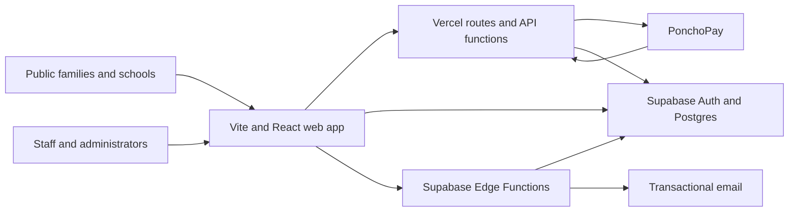

# Architecture

This document describes the current production architecture and gives contributors a practical tree view of the repository.

## System overview



The application is a single React codebase with three main surfaces:

1. The indexable public website.
2. The family booking and account experience.
3. The authenticated staff and administration workspace.

## Project tree

```text
.
├── api/                         Vercel server routes and PonchoPay callbacks
├── docs/                        Operational, deployment, privacy and QA guides
├── private-assets/              Non-public working assets; never shipped directly
├── public/                      Static images, icons and browser assets
├── scripts/                     Build, validation, migration and rehearsal tooling
├── src/
│   ├── app.jsx                  Application shell, public pages, routing and auth entry
│   ├── staticRender.jsx         Build-time renderer for complete public-page HTML
│   ├── PlatformModule.jsx       Main protected staff/admin workspace
│   ├── BookingLab.jsx           Family booking, account and booking administration UI
│   ├── StaffingModule.jsx       Workforce planning and staffing workflows
│   ├── PricingGroupsModule.jsx  Pricing groups, rules, assignments and reports
│   ├── EmployeeDocumentsModule.jsx
│   │                             Employee document creation and signing UI
│   ├── bookingSystem.js         Booking-system client operations
│   ├── supabaseClient.js        Shared Supabase data-access layer
│   ├── pdfExports.js            Client-side PDF exports
│   ├── styles.css               Shared application styling
│   └── bookingLab/              Booking data, calendars, readiness and payment adapters
├── supabase/
│   ├── functions/               Privileged server-side business workflows
│   └── migrations/              Ordered Postgres schema, RLS and function migrations
├── index.html                   Base HTML, metadata and crawler fallback
├── middleware.js               Request middleware
├── robots.txt                  Crawler rules copied into the production build
├── sitemap.xml                 Current indexable public URLs
├── vercel.json                 Hosting, redirects, rewrites and security headers
├── vite.config.js              Vite build configuration
└── package.json                Dependencies and supported commands
```

Generated directories such as `dist`, local `output` and temporary files are not source code and should not be committed unless a specific workflow requires it.

## Front-end composition

### Application shell

[src/app.jsx](src/app.jsx) owns public routing, page metadata, header/footer navigation, the staff-login boundary and top-level lazy loading. Routes use readable browser paths while React handles same-tab navigation.

### Public site

Public pages are rendered from `app.jsx`. During the production build, `staticRender.jsx` uses the same React page components to generate the complete initial HTML for every indexable route. The result includes the header, full page copy and headings, forms where relevant, internal links and footer before JavaScript loads. The browser bundle then replaces that static shell with the interactive application, avoiding a second separately maintained version of the page content.

Account, payment-return and staff routes remain client-rendered and `noindex`; only public information pages are statically generated.

The source of truth for discoverability is:

- [robots.txt](robots.txt)
- [sitemap.xml](sitemap.xml)
- [scripts/create-spa-route-files.mjs](scripts/create-spa-route-files.mjs)
- [scripts/seo-crawlability-check.mjs](scripts/seo-crawlability-check.mjs)

### Family booking

[src/BookingLab.jsx](src/BookingLab.jsx) contains the live booking journey and family portal. Supporting files under `src/bookingLab` provide school calendars, wraparound configuration, readiness logic and the PonchoPay adapter.

Booking creation, amendment, cancellation, credit and payment operations cross a server boundary before changing authoritative data.

### Staff platform

[src/PlatformModule.jsx](src/PlatformModule.jsx) composes the role-based internal workspace. Larger domains with independent workflows are split into dedicated modules, including staffing, employee documents and pricing groups.

Staff leavers retain their authentication account but move to a separate document-only portal. The `manage-staff-leaver` Edge Function archives the employment record, marks the profile inactive with former-staff status and sends the access-change email. A restrictive RLS policy blocks former accounts across operational tables regardless of their previous role; narrowly scoped policies continue to allow only their own P45, payslips, published employment documents and HR files.

### Public enquiry and CRM flow

The public contact and school-partnership forms submit to the `notify-public-enquiry` Edge Function. The function validates and rate-limits the request, computes a normalized content fingerprint, and calls a service-role-only database function that atomically returns either a new enquiry or the matching submission accepted during the preceding ten minutes. Only a newly accepted enquiry triggers an internal notification, so repeat clicks and lost-response retries do not duplicate records or email.

The admin CRM reads enquiry records, reply history and protected `email_logs` evidence under existing admin/superadmin RLS. It distinguishes saved records from browser-only data and shows notification outcomes as sent, failed, queued or unknown. Duplicate, test and spam classifications retain the original record, optional canonical-record link, classifying administrator and timestamp for auditability.

## Data and server boundaries

### Supabase

Supabase provides:

- Staff and parent authentication.
- Postgres storage for operational and customer records.
- Row Level Security for role and ownership boundaries.
- Edge Functions for privileged workflows and transactional email.
- Private file storage where records must not be publicly accessible.

[src/supabaseClient.js](src/supabaseClient.js) is the main browser data-access layer. It may call tables directly only where RLS is the security boundary. Privileged multi-step changes belong in an Edge Function or database function.

### Database migrations

Migrations in `supabase/migrations` are ordered and additive. Never edit a migration that has already reached production; add a new migration instead. Schema changes must preserve existing booking prices, invoices, signed documents and audit records.

### Edge Functions

Functions under `supabase/functions` handle operations such as:

- Parent registration and account management
- Booking creation, amendment and cancellation
- Parent credit adjustments and top-ups
- Pricing-group assignment
- Staff account, leaver access and pay security operations
- Employee document signing
- Finance invoice delivery
- Register and staffing notifications
- PonchoPay event processing

Shared email and security helpers live under `supabase/functions/_shared`.

### Vercel API routes

The `api` directory handles hosting-level integrations, including PonchoPay redirects, callbacks and webhooks. [vercel.json](vercel.json) maps external return routes into these handlers and applies no-store/noindex protection to account and payment paths.

## Authentication and permissions

Public content is anonymous. Family records require an authenticated parent account and ownership checks. Staff access is loaded from the matching profile role:

- Staff
- Manager
- Admin
- Superadmin

Former staff are a separate access state rather than an active role. They can read their own retained employment documents and their own minimal account identity only; they cannot access the staff workspace, other employees, children, bookings, registers, incidents, safeguarding, staffing, finance or message history.

UI visibility improves usability but is not the security boundary. RLS, database functions and Edge Functions must independently enforce access to safeguarding, employee, finance and customer data.

## Booking and payment flow

1. The family selects a school, child, activity, session and date.
2. The server resolves capacity and authoritative pricing.
3. Pricing-group or individual rules are frozen onto booking lines.
4. Zero-value bookings confirm without a payment provider.
5. Chargeable bookings create the appropriate PonchoPay route.
6. Callbacks update booking, invoice and account-credit state.
7. Confirmation, invoice and operational records are generated from saved data.

Frozen line pricing is an audit requirement: later rule changes must not silently reprice an existing booking.

## Build and deployment

Vite builds the browser application into `dist`. Post-build scripts prune unused assets, create clean static route entries and copy crawler discovery files. Vercel serves static files first, then applies the SPA rewrite for client-managed routes.

Production secrets are configured outside Git. Environment variable names are documented in [.env.example](.env.example); real values must remain in ignored local files, Vercel or Supabase settings.

## Validation strategy

Validation is layered:

- Static and secret-safety checks
- Production build verification
- Domain contract checks for booking, pricing, staffing, registers and employee documents
- Desktop/mobile launch QA
- Staging rehearsals for booking and parent-account workflows
- Live-readiness and provider-specific checks for PonchoPay

When changing a domain, run its contract test in addition to the general build and static checks.

## Documentation ownership

- `README.md`: setup, product scope and contributor entry point
- `CHANGELOG.md`: notable production changes
- `ARCHITECTURE.md`: modules, data boundaries and repository tree
- `docs/`: operational procedures and specialist runbooks

Update documentation in the same commit as the behaviour it describes.
